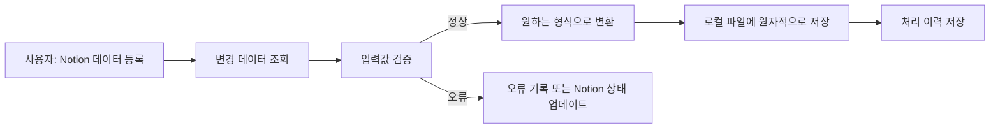

# Notion 데이터 로컬 변환·저장 프로젝트 계획서

## 1. 프로젝트 목표

사용자가 정해진 Notion 데이터베이스 양식으로 데이터를 등록하면 애플리케이션이 변경 내용을 감지하고 입력값을 검증한 뒤, 원하는 구조의 JSON, Markdown, CSV 등의 파일로 변환하여 로컬 저장소에 자동 저장한다.



## 2. 권장 구현 방향

초기 버전은 Python 기반의 폴링 방식으로 구현한다.

- Python은 JSON, YAML, Markdown 등 로컬 데이터 변환에 적합하다.
- 로컬 프로그램은 외부에서 접근할 수 없으므로 Notion 웹훅을 직접 받기 어렵다.
- MVP에서는 1~5분마다 Notion을 조회하고, 실시간 처리가 필요해질 때 웹훅으로 확장한다.
- Notion의 현재 API에서는 데이터베이스 아래의 `data_source`를 조회하며, 각 페이지가 데이터 행 역할을 한다.

MVP의 API 및 클라이언트 기준은 다음과 같이 고정한다.

- Python 버전: CPython `3.11` 이상
- Notion API 버전: `2026-03-11` (`Notion-Version` 헤더에 명시)
- HTTP 클라이언트: Python `httpx`를 사용해 REST API를 직접 호출
- 이유: Notion이 공식 지원하는 SDK는 JavaScript/TypeScript용이며, 직접 호출하면 Python에서 API 버전과 `data_sources` 엔드포인트를 명시적으로 통제할 수 있다.
- API 버전 변경은 설정이 아닌 코드 상수와 호환성 테스트로 관리하고, 버전 변경 PR에서 응답 fixture를 함께 갱신한다.

런타임 의존성은 `httpx`(HTTP), `pydantic` 2.x(데이터 모델), `pydantic-settings`(`.env`와 환경 변수), `PyYAML`(매핑 로딩), `portalocker`(Windows/Linux 파일 락)로 제한한다. 상태 저장과 JSON, CSV, 로깅에는 Python 표준 라이브러리의 `sqlite3`, `json`, `csv`, `logging`을 사용한다. 개발 의존성은 `pytest`, `pytest-httpx`, `pytest-cov`, `ruff`로 고정하고 정확한 버전과 해시는 `pyproject.toml`과 lockfile에 기록한다.

## 3. Notion 입력 양식

Notion 속성의 이름, 타입, 필수 여부와 상태값은 [Notion 입력 스키마](notion-schema.md)를 단일 기준으로 사용한다. 계획서에는 해당 표를 중복해서 유지하지 않는다.

처리 대상은 `상태 = 변환 요청`인 항목으로 한정한다. 사용자가 아직 작성 중인 데이터를 가져오는 것을 방지할 수 있다.

Notion 데이터베이스는 별도로 만든 integration에 공유해야 한다. 읽기만 수행하면 `Read content` 권한만 사용하고, 처리 상태와 오류 메시지를 Notion에 다시 기록하려면 `Update content` 권한도 추가한다.

## 4. 출력 형식과 변환 규칙

변환 규칙은 코드에 모두 고정하지 않고 설정 파일로 분리한다. 입력과 JSON·Markdown·CSV 기대 출력 예시는 [변환 규칙](transformation-rules.md)을 단일 기준으로 사용하며 계획서에는 중복하지 않는다.

변환 규칙에는 다음 항목을 포함한다.

- Notion 속성과 출력 필드의 매핑
- 필수 입력값과 타입
- 값 정규화 규칙
- 날짜 및 시간대 처리
- 파일명 생성 규칙
- JSON, Markdown, CSV 등 출력 타입
- 값이 없는 필드의 처리 방식

실제 키 이름, 타입, 기본값과 전체 YAML 예시는 [변환 규칙](transformation-rules.md)에 정의한다. 실행 설정은 `config/mappings.yaml`, 복사용 템플릿은 [`config/mappings.yaml.example`](../config/mappings.yaml.example)이다. 실행 시 YAML을 스키마에 따라 검증하며 알 수 없는 키는 오류로 처리한다.

## 5. 프로젝트 구조

```text
notion_link_project/
├─ src/
│  └─ notion_link/
│     ├─ notion_client.py       # Notion API 호출
│     ├─ fetcher.py             # 처리 대상 조회
│     ├─ models.py              # 입력·출력 데이터 모델
│     ├─ validator.py           # 입력값 검증
│     ├─ transformer.py         # 데이터 변환
│     ├─ writer.py              # 로컬 파일 저장
│     ├─ state_store.py         # 중복 처리 방지
│     ├─ service.py             # 전체 처리 흐름
│     └─ cli.py                 # 실행 명령
├─ tests/
│  └─ notion_link/
│     ├─ test_validator.py
│     ├─ test_transformer.py
│     ├─ test_writer.py
│     └─ test_service.py
├─ docs/
│  ├─ project-plan.md
│  ├─ getting-started.md
│  ├─ notion-schema.md
│  └─ transformation-rules.md
├─ output/                      # 생성 결과, 정책에 따라 Git에서 제외
├─ .state/                      # SQLite 상태 DB, Git에서 제외
├─ config/
│  ├─ mappings.yaml
│  └─ mappings.yaml.example
├─ .env.example
├─ .gitignore
├─ pyproject.toml
└─ README.md
```

`output/`에 개인정보나 민감한 Notion 데이터가 들어가면 반드시 Git에서 제외한다. 결과 변경 이력이 필요한 경우에만 검토 후 버전 관리한다.

## 6. 동기화 처리 흐름

한 번의 동기화는 다음 순서로 동작한다.

1. 환경 변수에서 `NOTION_TOKEN`, `NOTION_DATABASE_ID`와 선택적 `NOTION_DATA_SOURCE_ID`를 읽는다.
2. `NOTION_DATA_SOURCE_ID`가 없으면 `GET /v1/databases/{database_id}`로 하위 data source를 찾는다. 하나면 자동 선택하고, 여러 개면 모호성 오류를 내고 ID 지정을 요구한다.
3. 선택한 data source의 스키마를 조회하고 `config/mappings.yaml`과 일치하는지 검증한다.
4. 설정에서 `request`로 매핑된 상태(기본값 `변환 요청`)의 페이지를 조회한다.
5. 페이지 ID와 최종 수정 시각으로 이미 처리한 데이터인지 확인한다.
6. 필수 속성과 데이터 타입을 검증한다.
7. 내부 표준 데이터 모델로 변환한다.
8. 요청된 JSON, Markdown 또는 CSV 형식으로 직렬화한다.
9. 임시 파일을 만든 다음 최종 경로로 교체하여 원자적으로 저장한다.
10. 로컬 처리 이력에 페이지 ID, 수정 시각, 결과 경로와 체크섬을 기록한다.
11. 설정에서 매핑한 `success` 또는 `error` 상태와 오류 메시지를 Notion에 기록한다.

MVP의 파일 경로는 **페이지 ID 기반 덮어쓰기**로 확정한다.

```text
output/<분류>/<notion-page-id>.<확장자>
```

예: `output/meeting/01234567-89ab-cdef-0123-456789abcdef.md`. 제목 변경이나 중복 제목에도 경로가 바뀌지 않으며, 같은 페이지가 수정되면 동일 경로를 원자적으로 교체한다. 날짜별 이력 파일이나 제목 기반 경로는 MVP 범위에서 제외한다.

수정·삭제 및 상태 변경 정책은 다음과 같이 확정한다.

- `last_edited_time` 또는 콘텐츠 해시가 달라진 처리 요청은 기존 파일을 원자적으로 갱신한다.
- 상태가 `변환 요청`에서 다른 값으로 바뀌면 새 처리를 시작하지 않는다. 이미 성공한 산출물은 보존한다.
- 정상 처리 후에는 상태를 `완료`, 검증 또는 변환 실패 후에는 `오류`로 변경한다.
- Notion 페이지가 휴지통으로 이동·삭제되거나 접근 권한을 잃어도 MVP는 로컬 파일을 자동 삭제하지 않는다. 정기 대조 시 상태 저장소에 `orphaned`와 확인 시각을 기록하고 경고한다.
- 로컬 파일 삭제 기능은 추후 명시적 `prune --dry-run`/`prune` 명령으로만 제공하며 MVP에는 포함하지 않는다.

## 7. 중복 및 장애 처리

MVP 상태 저장소는 `.state/notion-link.db`의 SQLite로 확정한다. Python 표준 `sqlite3`를 사용하고 WAL 모드, 트랜잭션, `notion_page_id` 기본 키로 중복 처리와 비정상 종료 복구를 보장한다. JSON 상태 파일은 동시 갱신과 부분 쓰기 복구가 취약하므로 사용하지 않는다.

```text
notion_page_id
last_edited_time
content_hash
output_path
processed_at
status
error_message
last_seen_at
orphaned_at
```

장애 대응 기준은 다음과 같다.

- 동기화 시작 시 `output/.sync.lock`에 OS 수준 배타 락을 잡고, 이미 실행 중이면 파일을 변경하지 않고 종료 코드 `3`으로 종료
- API 연결 타임아웃 10초, 응답 읽기 타임아웃 30초
- `429`, `500`, `502`, `503`, `504` 및 일시적 네트워크 오류는 최대 5회 재시도
- 재시도 간격은 0.5초에서 시작해 2배씩 증가하고 8초로 제한하며 jitter를 추가; `429`의 `Retry-After`가 있으면 우선 적용
- 인증·권한·검증 오류인 `400`, `401`, `403`, `404`는 자동 재시도하지 않음
- Notion 요청 제한 응답 처리
- 유효하지 않은 입력은 출력하지 않고 오류 기록
- 일부 항목 실패가 전체 동기화를 중단하지 않도록 격리
- 프로세스를 다시 실행해도 결과가 중복되지 않도록 멱등성 보장
- 출력 파일을 직접 덮어쓰지 않고 임시 파일 생성 후 교체
- 페이지네이션을 적용하여 전체 처리 대상을 조회
- 필요한 속성만 조회해 응답 크기와 처리 시간을 절감

락은 프로세스가 종료되면 운영체제가 해제하는 파일 락으로 구현하여, 비정상 종료 후 남은 빈 락 파일 자체가 다음 실행을 막지 않게 한다.

## 8. 실행 방식

MVP에서는 다음 명령을 제공한다.

```shell
python -m notion_link sync
python -m notion_link sync --dry-run
python -m notion_link validate-config
```

- `sync`: 실제 조회, 변환 및 저장
- `sync --dry-run`: 파일이나 Notion을 변경하지 않고 예상 결과 확인
- `validate-config`: 환경 변수와 필드 매핑 검증

자동 실행은 Windows 작업 스케줄러, cron, GitHub Actions self-hosted runner 또는 장시간 실행되는 로컬 프로세스 중 환경에 맞는 방식을 사용한다.

MVP의 실패 알림 채널은 구조화 로그와 프로세스 종료 코드로 고정한다. 전체 성공은 `0`, 일부 페이지 실패는 `2`, 동시 실행 감지는 `3`, 구성·인증 등 실행 불가 오류는 `1`이다. 작업 스케줄러나 cron이 비정상 종료를 감지하도록 구성한다. Slack·이메일 직접 알림은 운영 환경과 비밀값 관리 방식이 정해진 뒤 별도 확장으로 둔다.

로그는 `logs/notion-link.log`에 기록하고 매일 자정 회전하며 30일간 보존한다. 토큰, 원문 본문, 전체 페이지/데이터베이스 ID는 기록하지 않고 ID는 마지막 8자만 남긴다. 콘솔에는 INFO 이상, 파일에는 진단용 DEBUG 이상을 기록하며 `logs/`는 Git에서 제외한다.

## 9. 웹훅 확장

실시간 처리가 필요하면 2차 단계에서 웹훅을 도입한다.

- Notion 웹훅은 변경 사실과 페이지 ID 등을 전달한다.
- 전체 변경 데이터는 웹훅에 포함되지 않으므로 이벤트 수신 후 Notion API로 최신 페이지를 다시 조회한다.
- 웹훅 엔드포인트는 공개 HTTPS 주소여야 한다.
- `X-Notion-Signature`를 검증한다.
- 중복 또는 순서가 바뀐 이벤트를 안전하게 처리한다.

로컬 저장이 목적이라면 다음 중 하나가 필요하다.

- 로컬 터널로 웹훅 직접 수신
- 클라우드 웹훅 서버가 큐에 넣고 로컬 에이전트가 가져오기
- 항상 켜져 있는 사내 서버에서 처리
- 폴링 방식 유지

개인용 프로젝트라면 폴링 방식이 운영 복잡도와 보안 측면에서 가장 단순하다.

## 10. 테스트 계획

테스트 프레임워크는 `pytest`로 확정한다. 외부 HTTP는 `pytest-httpx`로 차단·모의하고, fixture에는 비식별 응답만 저장한다. 커버리지는 `pytest-cov`로 측정하며 초기 전체 기준은 80%, 변환·경로·상태 저장 모듈은 90%로 둔다.

### 단위 테스트

- Notion 속성별 값 파싱
- 필수 필드 누락
- 잘못된 날짜와 숫자
- 특수문자가 포함된 파일명
- JSON 및 Markdown 변환
- CSV 헤더 순서, UTF-8 인코딩, 쉼표·따옴표·줄바꿈 escaping, 다중 값 구분자와 빈 값 처리
- 동일 데이터 중복 처리
- 수정된 데이터 재처리
- 원자적 파일 저장

### 통합 테스트

- 저장해 둔 Notion API 응답 fixture 사용
- 여러 페이지의 페이지네이션
- 429, 503 응답과 재시도
- 일부 페이지 변환 실패
- 처리 상태 업데이트 실패

### 수동 인수 테스트

1. Notion에 정상 데이터를 등록한다.
2. 상태를 `변환 요청`으로 변경한다.
3. 동기화 명령을 실행한다.
4. 원하는 경로와 형식으로 파일이 생성되는지 확인한다.
5. 같은 명령을 다시 실행해 중복 파일이 생기지 않는지 확인한다.
6. Notion 내용을 수정한 후 결과가 올바르게 갱신되는지 확인한다.
7. 상태를 다른 값으로 바꾸거나 페이지를 삭제해도 기존 파일이 자동 삭제되지 않고 경고 상태가 기록되는지 확인한다.
8. 동기화를 동시에 두 번 실행해 두 번째 프로세스가 종료 코드 `3`으로 끝나는지 확인한다.

## 11. 보안 원칙

- `NOTION_TOKEN`은 환경 변수로만 전달
- 실제 `.env` 파일은 커밋하지 않음
- `.env.example`에는 변수명과 안전한 예시만 기록
- Notion 데이터베이스 ID와 민감한 페이지 ID를 로그에서 마스킹
- integration에는 필요한 데이터베이스만 공유
- 민감한 출력 데이터가 있다면 `output/`을 Git에서 제외
- 로그에 원문 데이터 전체를 남기지 않음

## 12. 단계별 일정과 완료 기준

### 1단계: 요구사항 및 양식 확정

- Notion 속성 목록 확정
- 출력 예시 2~3개 작성
- 페이지 ID 기반 덮어쓰기 경로 확인
- 수정 시 갱신, 삭제·상태 이탈 시 보존 정책 확인

완료 기준: 하나의 Notion 입력과 정확히 대응하는 기대 출력 파일이 문서화되어 있다.

### 2단계: 프로젝트 기반 구축

- Python 프로젝트와 의존성 설정
- 환경 변수 로딩
- 로깅 및 CLI 구성
- Notion 연결 확인 명령 구현

완료 기준: 로컬에서 대상 data source 정보를 읽을 수 있다.

### 3단계: MVP 동기화

- 처리 대상 조회
- 입력 검증
- 내부 데이터 모델 변환
- JSON 또는 Markdown 저장
- 중복 처리 방지

완료 기준: Notion 항목 하나를 로컬 파일 하나로 안정적으로 변환한다.

### 4단계: 신뢰성 강화

- 페이지네이션
- 재시도와 오류 격리
- 원자적 저장
- 수정 데이터 재처리
- `--dry-run`
- 테스트 자동화

완료 기준: 반복 실행과 부분 실패에도 결과가 일관된다.

### 5단계: 자동화 및 운영

- Windows 작업 스케줄러 또는 cron 등록
- 일 단위 로그 회전과 30일 보존
- 종료 코드 기반 스케줄러 실패 알림
- 선택적으로 Notion 처리 상태 업데이트

완료 기준: 수동 개입 없이 주기적으로 동기화된다.

### 6단계: 선택적 웹훅 전환

- 공개 HTTPS 엔드포인트 구성
- 웹훅 검증과 서명 검사
- 이벤트 중복 방지
- 로컬 저장 프로세스와 연결

완료 기준: Notion 변경 후 짧은 시간 안에 로컬 결과가 갱신된다.

## 13. 확정 사항과 후속 선택 사항

MVP에서 확정한 사항은 다음과 같다.

1. Notion 속성과 한국어 상태값은 `config/mappings.yaml`에서 매핑한다.
2. 기본 출력은 페이지별 Markdown 한 개이며 경로는 `output/<분류>/<page-id>.md`이다.
3. 수정은 같은 경로를 원자적으로 갱신하고, 삭제·상태 이탈 시 기존 파일은 보존한다.
4. 결과물과 로그는 기본적으로 로컬에만 보관하고 Git에서 제외한다.
5. API는 `2026-03-11` 버전과 Python `httpx` 직접 호출을 사용한다.
6. CPython 3.11 이상, SQLite 상태 저장소, `pytest` 테스트 체계를 사용한다.

JSON/CSV 동시 생성 여부, 출력물의 Git 관리, Slack·이메일 알림, 명시적 고아 파일 정리는 MVP 이후 선택 사항이다.

첫 번째 MVP 목표는 다음과 같이 정한다.

> `변환 요청` 상태의 Notion 항목을 조회하여 페이지별 Markdown 파일로 저장하고, 반복 실행 시 중복 파일을 만들지 않는 CLI를 구현한다.

## 14. 참고 문서

- [Notion 입력 스키마](notion-schema.md)
- [변환 규칙 및 mappings.yaml 스키마](transformation-rules.md)
- [빠른 시작](getting-started.md)
- [Notion Query a data source](https://developers.notion.com/reference/query-a-data-source)
- [Notion Retrieve a database](https://developers.notion.com/reference/retrieve-a-database)
- [Notion Retrieve a data source](https://developers.notion.com/reference/retrieve-a-data-source)
- [Notion API versioning](https://developers.notion.com/reference/versioning)
- [Notion Connection capabilities](https://developers.notion.com/reference/capabilities)
- [Notion Authorization](https://developers.notion.com/guides/get-started/authorization)
- [Notion Webhooks](https://developers.notion.com/reference/webhooks)
- [Notion Webhook event delivery](https://developers.notion.com/reference/webhooks-events-delivery)
